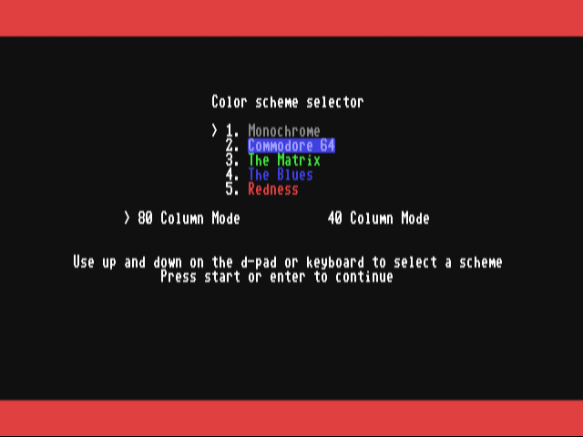
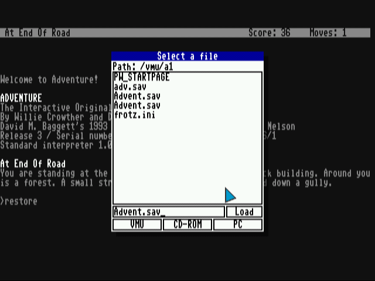
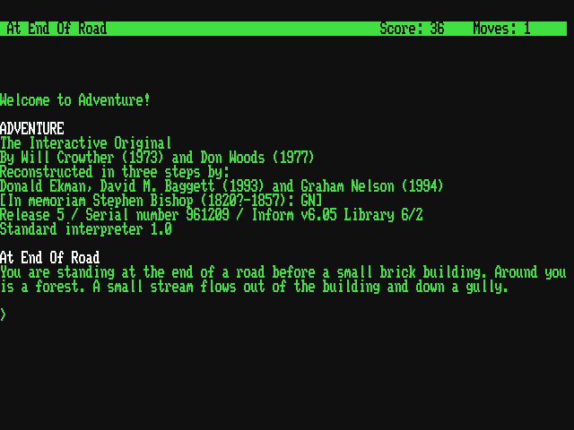
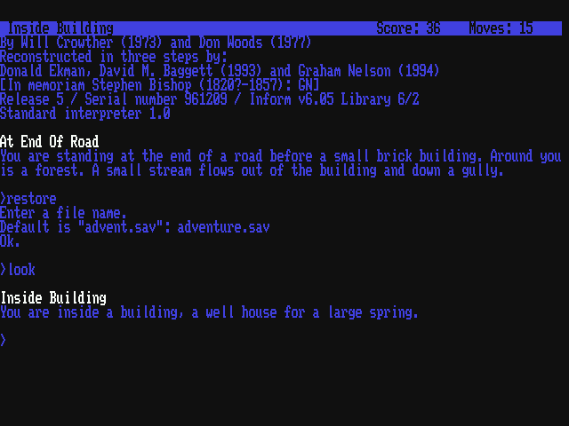
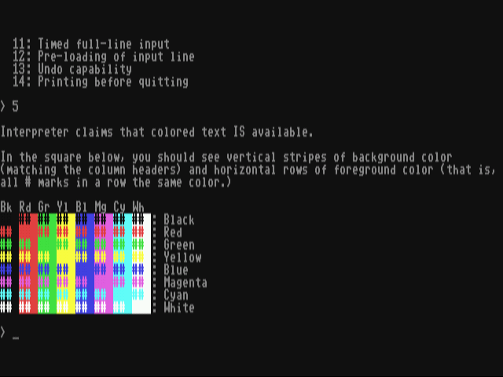

# FrotzDC

FrotzDC is an Interactive Fiction interpreter for the Sega Dreamcast which can play v1 through v5 [Z-machine](https://en.wikipedia.org/wiki/Z-machine) games. Several popular Z-Machine games include the Zork trilogy, Adventure, and The Hitchhiker's Guide to the Galaxy.

People that are new to Interactive Fiction should check out [the Beginner's Guide to Interactive Fiction](beginner.txt) by Joe W Aultman and may wish to play several games online in their browser at [iFiction](http://www.ifiction.org). A great site to download freeware games for use with FrotzDC is [The Interactive Fiction Archive](http://www.ifarchive.org/).

FrotzDC is based on [UNIX Frotz](https://gitlab.com/DavidGriffith/frotz) version 2.43, which is released under the GNU General Public License.

## Sound

The latest version of FrotzDC has limited support for sound effects. In order to use sound you will need to convert your audio files to wav format and put them in a folder with the same name as the game. For example, for sherlo.z5, you would have a folder named "sherlo" to contain the files.

## Fonts

FrotzDC requires a font file on the root of the CD named `hybrid.fnt`.
The original release includes a font that supports [MS-DOS code page 437](https://en.wikipedia.org/wiki/Code_page_437), which is available in this repo as [cp437.fnt](fonts/cp437.fnt).
A new font supporting latin1 was contribued by @hlabrand is available in this repo as [latin1.fnt](fonts/latin1.fnt).
Either file can be renamed to `hybrid.fnt` on the root of your Dreamcast CD-ROM depending on which character set is required for your Z-Machine game.

## Screenshots
 

## Downloads

 * [FrotzDC v1.1](https://github.com/c99koder/FrotzDC/releases/download/1.1/frotzdc-1.1-dc.zip)
 * [libc99 3.0](https://github.com/c99koder/FrotzDC/releases/download/1.1/libc99-3.0.tar.gz)
 * [Source code](https://github.com/c99koder/FrotzDC/archive/1.1.tar.gz)

## License

FrotzDC is free software; you can redistribute it and/or modify
it under the terms of the GNU General Public License as published by
the Free Software Foundation; either version 2 of the License, or
(at your option) any later version.

FrotzDC is distributed in the hope that it will be useful,
but WITHOUT ANY WARRANTY; without even the implied warranty of
MERCHANTABILITY or FITNESS FOR A PARTICULAR PURPOSE.  See the
GNU General Public License for more details.

You should have received a copy of the GNU General Public License
along with this program; if not, write to the Free Software
Foundation, Inc., 59 Temple Place - Suite 330, Boston, MA 02111-1307, USA
